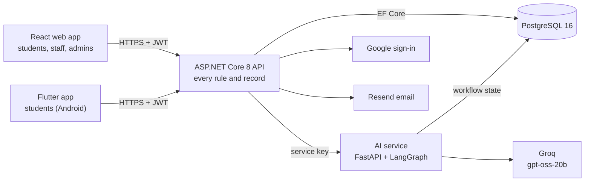
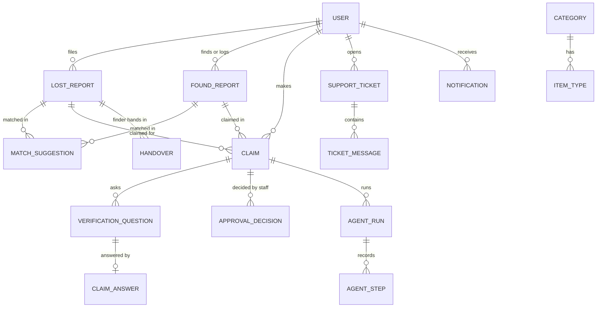

# FoundU

A campus lost-and-found service. Students report what they lost, finders post or hand in what
they found, and the security desk keeps items until an owner proves ownership and collects
them. AI agents help match, describe and question, but a person at the desk makes every
decision.

[](https://github.com/jaliyavox/FoundU/actions/workflows/ci.yml)

| | |
|---|---|
| Web app | https://foundu-web.onrender.com |
| API | https://foundu-api.onrender.com ([health](https://foundu-api.onrender.com/api/health)) |
| AI service | https://foundu-ai.onrender.com/health |
| Run it locally | [docs/startup.md](docs/startup.md) |

The services run on Render's free plan and sleep after 15 minutes without requests. The first
request after that takes about a minute.

---

## What it does

| Role | Main features |
|---|---|
| **Student (owner)** | Report a lost item with a time window and photos; the AI fills in type and colour from the description; see "Might be yours" matches; claim an item; answer verification questions; collect with a 6-digit code |
| **Student (finder)** | Post a found item on the Found board; press "I found this" on someone's report and message them; hand it to security with a handover code; earn honor points |
| **Staff (security desk)** | One "Pull it up" box for every code; log walk-in items with a hidden verification detail; receive and release handovers after an ID check; review claims with AI-drafted questions and a recommendation; approve or reject; answer support tickets |
| **Admin** | Everything staff can do, plus users (search, roles, suspend), places and categories, analytics, moderation and overturning rejected claims |

Everyone gets **Ask FoundU**, a chat that turns "I lost a blue bottle near the library" into a
report or a search. There is also a **support assistant** that answers from the help guide or
drafts a ticket. In-app notifications cover every step, and email covers sign-up confirmation
and password resets.

## Architecture



- **One API owns every rule.** Both apps are thin clients. The API is the only part that talks
  to the database, the AI service, Google and Resend.
- **The AI advises, people decide.** Agents return recommendations. Every approval, rejection,
  handover and record change is made by C# code in the API or by a staff member.
- **It keeps working without AI.** If the AI service or the model is down, reports, claims and
  handovers still work. Each agent has a deterministic fallback.

### API layers (clean architecture)

| Project | Holds |
|---|---|
| `FoundU.Domain` | Entities, enums, rules that need no I/O |
| `FoundU.Application` | DTOs, FluentValidation validators, service interfaces, exceptions |
| `FoundU.Infrastructure` | EF Core and migrations, ASP.NET Identity, JWT, AI clients, email, Google, photo storage, services |
| `FoundU.Api` | Controllers, global error handler, validation filter, rate limiting, Swagger |

## Tech stack

| Part | Technology |
|---|---|
| API | ASP.NET Core 8, EF Core 8 + Npgsql, ASP.NET Identity, JWT bearer with rotating refresh tokens, FluentValidation, Swashbuckle |
| Database | PostgreSQL 16 (31 tables, code-first migrations applied on start) |
| Web | React 19, TypeScript, Vite, TanStack Query, React Router 7, Tailwind CSS 4, shadcn/ui on Base UI, Recharts |
| Mobile | Flutter (Android), Riverpod, go_router, Dio, flutter_secure_storage, image_picker |
| AI service | Python 3.11+ (3.12 in Docker), FastAPI, LangGraph, Pydantic; model on Groq (`openai/gpt-oss-20b`); a deterministic `fake` provider for tests and demos; Ollama also supported locally |
| Integrations | Google sign-in (web and Android), Resend (transactional email) |
| Hosting | Render Blueprint: managed PostgreSQL, two Docker web services, one static site |
| CI | GitHub Actions: four parallel jobs on every push and pull request |

## AI agents

Six agents run in one LangGraph graph. Each has a validated plan, a tool allow-list and a strict
output schema.

| Agent | What it does | Uses the model? |
|---|---|---|
| Description parser | Pulls item type, colours and up to 5 features out of a description | Yes; every extracted fact is checked against the original text |
| Matching | Scores a lost report against a found item: match candidate, manual review or no match | No; 0.40 type + 0.20 colour + 0.25 description overlap + 0.15 location |
| Verification | Drafts up to 3 ownership questions and grades answers against the hidden detail | No; fixed templates and word-overlap grading |
| Coordinator | Maps a claim's state to the next step and pauses for staff approval | No; a fixed table with a durable human checkpoint |
| Intake (Ask FoundU) | Asks one question at a time, then fills in a lost or found report | Yes, to fill slots; keyword fallback |
| Support | Answers from FoundU's help guide, or drafts a ticket | Yes, only to pick a guide topic by id |

**Guardrails**
- Every model reply must match a strict schema, or it is rejected.
- Student text is treated as data, so instructions inside it are ignored.
- The hidden verification detail never reaches students or the model's questions.
- Prompts, keys and answers are never logged.
- No agent has permission to approve anything.

**Evaluation:** 68 cases in nine categories (task completion, agent selection, tool selection,
structured output, business rules, prompt injection, approval enforcement, failure recovery,
safe failure). All 68 pass both deterministically and live against Groq. See
`ai/tests/evaluation`.

## Data model



Some rules are enforced in the database itself:
- A filtered unique index allows one approved claim per found item.
- PostgreSQL's `xmin` row version stops two desks saving the same row at once.
- Records are soft-deleted.
- Every status change is kept as a history row.

## API

The API has 104 REST endpoints in 23 controllers, all under `/api`. The main groups are `auth`,
`profile`, `lost-reports`, `found-posts`, `found-reports`, `handovers`, `desk/codes`,
`match-suggestions`, `claims`, `intake`, `support`, `notifications`, `reference` and `admin/*`.

| Concern | How |
|---|---|
| Authentication | JWT access tokens (15 min) and refresh tokens (14 days), stored hashed and rotated on every use; reusing an old one revokes every session |
| Authorisation | `Student`, `Staff` (Staff or Admin) and `Admin` policies on every endpoint, plus ownership checks in each service |
| Validation | FluentValidation on every request body |
| Errors | RFC 7807 ProblemDetails: 400, 401, 403, 404, 409 (including concurrency clashes), and 500 with no internal detail in production |
| Abuse | Account-email endpoints are limited to 5 requests a minute; strict security headers; NUL bytes refused |
| Docs | Swagger UI at `http://localhost:5292/swagger` in Development (off in production) |

## Testing

| Suite | Tool | Result |
|---|---|---|
| API | xUnit, WebApplicationFactory, real PostgreSQL 16 | 225 pass, 67.3% line coverage |
| AI service | pytest | 396 pass, 91% line coverage |
| Web | Vitest, React Testing Library | 54 pass |
| Mobile | flutter_test (unit, widget, live-API integration) | 89 + 4 pass |
| End-to-end | Playwright | 33 pass (sign-in and guards, full claim workflow, desk hand-in, CSP) |
| Accessibility | axe-core, Lighthouse | 0 axe violations on 11 pages |
| Performance | k6 | p95 6 ms at 50 users; 147 ms at 300 users with no failures |
| Security | Newman (36 checks), OWASP ZAP | All checks pass after fixes |

Evidence lives in [`testing/reports`](testing/reports). The commands to re-run every tool are in
[`testing/README.md`](testing/README.md), and the defect log is in
[`docs/testing/test-report.md`](docs/testing/test-report.md).

## CI/CD

`.github/workflows/ci.yml` runs four jobs on every push to `main` and on every pull request:

- **API:** build and test
- **Web:** lint, test and build
- **Mobile:** analyze and test
- **AI:** ruff and pytest, against a PostgreSQL service

Render deploys `main` from [`render.yaml`](render.yaml).

## Running it

The short version, with Docker, .NET 8, Python 3.11+, Node 20+ and Flutter installed:

```bash
export AI_SERVICE_KEY=$(openssl rand -hex 32)
testing/start-stack.sh     # PostgreSQL :5434, AI service :8000, API :5292, web :5173
```

[**docs/startup.md**](docs/startup.md) starts each server by hand: the model provider choices,
the environment variables, the mobile app, demo data and troubleshooting.

### Deploying to Render

1. In the Render dashboard, choose **New → Blueprint** and pick this repository.
2. Fill in the secrets Render asks for:

| Service | Setting | Value |
|---|---|---|
| foundu-ai | `LLM_API_KEY` | A Groq API key |
| foundu-api | `AiService__BaseUrl` | `https://foundu-ai.onrender.com` |
| foundu-api | `Seed__DevAdminPassword` | Password for `admin@foundu.com`, used on the first start |
| foundu-api | `Cors__AllowedOrigins__0`, `Email__WebBaseUrl` | `https://foundu-web.onrender.com` |
| foundu-api | `Email__ResendApiKey` | A Resend API key |
| foundu-api | `Google__ClientId` | The Google **Web** OAuth client id |
| foundu-web | `VITE_API_BASE_URL` | `https://foundu-api.onrender.com` |

Render generates the JWT signing key and the AI service key, and shares the service key between
the two services. Then:

3. In Google Cloud Console, add the web URL to the OAuth client's authorised JavaScript origins.
4. Build the Android app against production:
   `flutter build apk --dart-define=FOUND_U_API_BASE_URL=https://foundu-api.onrender.com`

Free-plan limits:
- Uploaded photos are stored in PostgreSQL, so a redeploy doesn't lose them.
- The free database expires 30 days after it is created.
- Groq's free tier has rate limits. When one is hit, the agents fall back to keywords.

### Integrations

- **Google sign-in.** It stays off until `Google__ClientId` is set; with no client id, the button
  is hidden. Create a **Web application** OAuth client with the web app's origins. For Android,
  also create an **Android** client with package `com.example.foundu` and your keystore's
  SHA-1. The API verifies every ID token against the Web client id.
- **Email (Resend).** Confirmation and password-reset links are sent from a verified domain. With
  no key in Development, each email (link included) is written to the API log instead. Reserved
  test addresses (`*.test`) are never mailed.

## Repository layout

| Path | Contents |
|---|---|
| `api/` | ASP.NET Core solution: `src/` (four projects) and `tests/FoundU.Tests` |
| `web/` | React app, organised by feature (`src/features/<area>`) |
| `mobile/` | Flutter app, organised by feature (`lib/features/<area>`, shared code in `lib/core`) |
| `ai/` | FastAPI service: `app/agents` (the six agents, plans, graph), `app/llm` (providers), `tests/` |
| `testing/` | Playwright, k6, Newman suites, start and stop scripts, and all test evidence |
| `scripts/` | `demo_seed.py` (rebuilds demo data), `smoke_full_stack.py` (end-to-end smoke test) |
| `docs/` | Startup guide, design conventions, user stories, test report |

## Documentation

- [docs/startup.md](docs/startup.md): starting every server, locally and on Render
- [docs/design.md](docs/design.md): UI conventions, brand, tokens, accessibility rules
- [docs/testing/user-stories.md](docs/testing/user-stories.md): 59 user stories with acceptance criteria
- [docs/testing/test-report.md](docs/testing/test-report.md): defects found and fixed, known issues
- [testing/README.md](testing/README.md): every test tool and how to re-run it

## Working agreements

- No direct commits to `main`. Work on a branch and open a pull request that a teammate reviews.
- CI must be green before merging.
- Secrets are never committed. Local secrets go in the git-ignored `appsettings.Development.json`
  and `.env.local`.

## Team

SE3090 group project by Jaliya Hettiarachchi ([@jaliyavox](https://github.com/jaliyavox)),
[@Braveena15](https://github.com/Braveena15), [@ParamiDinethma](https://github.com/ParamiDinethma)
and [@uthpalaWAS](https://github.com/uthpalaWAS).
